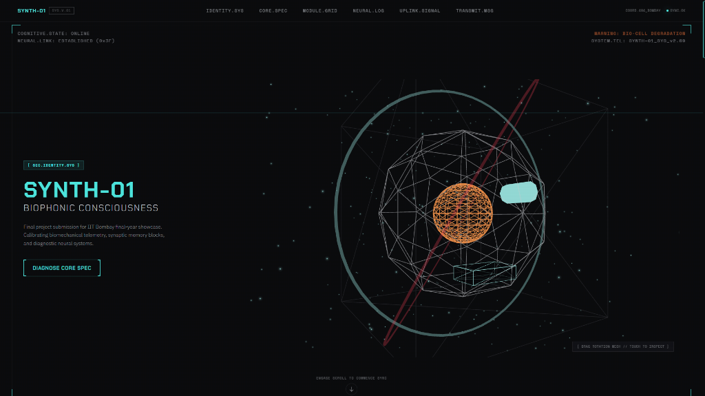

# 🤖 SYNTH-01 // DIAGNOSTIC HUD

```text
┌────────────────────────────────────────────────────────┐
│  SYNTH-01 : COGNITIVE DIAGNOSTIC HUD & NEURAL UPLINK   │
│  Version: 1.0.0-beta      Status: Operational [200 OK] │
└────────────────────────────────────────────────────────┘
```

An interactive, premium terminal-inspired diagnostic HUD landing page built for simulating real-time biophonic telemetry. Powered by **React 19**, **Tailwind CSS v4**, **Vite**, **React Three Fiber (Three.js)**, and **GSAP**.

---

## 🖥️ System Preview

Below is the active biophonic core interface showcasing the interactive 3D neural mesh and real-time telemetry readout:



---

## 🎬 Terminal Walkaround Session

Watch the boot sequence loader reaching 100%, page transitions, hover states, and live telemetry forms in action:


---

## ⚡ System Commands

To bootstrap, compile, or audit the terminal, execute the following commands in your shell:

```bash
# Clone the system core
❯ git clone https://github.com/darshsharma-bit/cyborg-theme.git
❯ cd cyborg-theme

# Initialize environment dependencies
❯ npm install

# Boot development environment (Local: http://localhost:5173 or 5174)
❯ npm run dev

# Audit system logic using oxlint
❯ npm run lint

# Compile production-ready telemetry distribution
❯ npm run build
```

---

## 🛠️ Telemetry Specifications

| System Sub-Module | Engine / Stack | Performance Impact |
| :--- | :--- | :--- |
| **3D Neural Mesh** | Three.js + R3F + Drei | Low (GPU Accelerated Orbit controls) |
| **Core Boot Sequence** | Framer Motion | Smooth 60FPS exit transition |
| **Telemetry Ticker Log** | GSAP Timelines | Optimized micro-tick log output |
| **HUD Grid Panels** | Tailwind CSS v4 | Zero runtime overhead (Utility compiler) |
| **Secure Broadcast** | React Hooks + State | Client-validated transmission packets |

---

## 📂 System File Tree

```text
cyborg-theme/
├── .vscode/
│   └── settings.json         # Workspace CSS validator custom at-rule bypass
├── docs/
│   ├── hero-dashboard.png    # Live interface overview image
│   └── walkaround-demo.webp  # Interactive walkthrough animation
├── public/
│   └── favicon.svg           # Custom system core icon
└── src/
    ├── animations/
    │   └── gsapTimelines.js  # GSAP ticker setups and logger controls
    ├── components/
    │   ├── BootSequence/     # System initializer boot-up screen
    │   ├── Hero3D/           # 3D interactive mesh scene
    │   ├── CoreSpec/         # System structural data grid
    │   ├── ModuleGrid/       # Neon metrics telemetry panels
    │   ├── NeuralLog/        # Dynamic diagnostic logging feed
    │   ├── UplinkSignal/     # Transmission monitoring graphs
    │   ├── TransmitForm/     # Broadcast contact form
    │   └── Footer/           # Terminal console status footer
    ├── styles/
    │   ├── tokens.css        # Raw custom hex color tokens and variables
    │   └── globals.css       # Core Tailwind CSS imports and @theme configurations
    ├── App.jsx               # Entry router and layout coordinator
    └── main.jsx              # DOM bootstrapper
```

---

## ⚙️ Tailwind CSS v4 Theme Integration

Tailwind v4 handles custom styling tokens directly within your CSS file ([src/styles/globals.css](src/styles/globals.css)) using the `@theme` directive, linking parameters to CSS variables inside [src/styles/tokens.css](src/styles/tokens.css):

```css
@theme {
  --color-void-black: var(--void-black);
  --color-signal-cyan: var(--signal-cyan);
  --color-warning-amber: var(--warning-amber);
  --color-vein-red: var(--vein-red);
  
  --font-display: var(--font-display);
  --font-mono: var(--font-mono);
}
```

### 🔧 IDE warning resolution
If your editor complains about `@theme` being an unknown at-rule, we solved it by adding the following to [.vscode/settings.json](.vscode/settings.json):
```json
{
  "css.lint.unknownAtRules": "ignore"
}
```

---

```text
[ SYSTEM STATUS: READY ] ─── [ CONNECTION: SECURE ] ─── [ CORE: CALIBRATED ]
```
